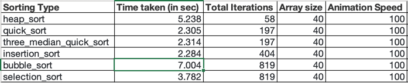
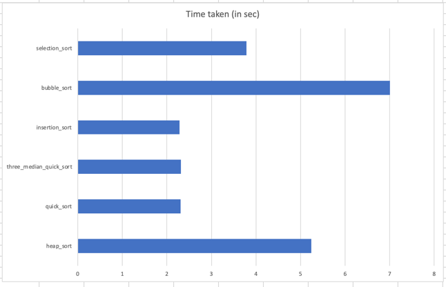
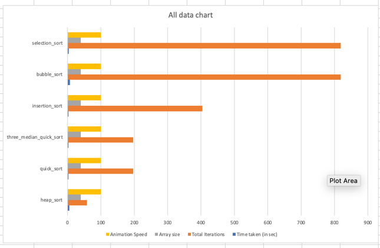

# Sorting Visualization

This is a project to show sorting visualization, it is hosted in GitHub
at [Sorting Visualization](https://vighneshs.github.io/sorting-visualization/).

We have the following 6 sorting algorithms visualized:

1. Insertion Sort
2. Bubble Sort
3. Selection Sort
4. Quick Sort
5. 3 median Quick Sort
6. Heap Sort

## Setup

We need to just clone the project from GitHub from
[this](https://github.com/VighneshS/sorting-visualization)
repository using the following commands:

```
git clone https://github.com/VighneshS/sorting-visualization
```

Once, you have cloned the repository you need to open the [index.html](index.html)
located at the root directory of the repository using any html client browser.

## About the UI

The UI consists of 4 inputs with default values loaded in them by default:

- Combo Select dropdown to input the type of sort containing all the 6 sorting algorithm specified above.
- Maximum number text input to input the maximum value that can be used to generate the numbers in the array using a
  random generator
- Size number input to put in the total size of the array.
- The animation speed to control the speed of the sorting animation

There are 4 control buttons to perform any action to interact with the UI:

- Generate:
    - It is used to generate a new array everytime we press it based on the maximum and size value inputs.
- Sort is used to sort the generated array.
- Reset is used to reset the array to its original state if sorted by any algorithm. This is useful to compare the
  performance with the same array with multiple algorithms.
- Clear History is used to clear the history which is recorded each and everytime when a sort gets finished.

The next is time taken, and the number of iterations that are out put fields which show the total time taken for the
sort, and the number of iterations that took for the logic to perform.

The next part is the histogram bars which will show a comparative view of the array with heights of bars and colors.

The next section is the Histories section which will show table history of all the sorts done in the session. The data
is stored in session storage which will clear off if the browser or client session ends.

The history stores the following data:
- Sorting type.
- Time taken in seconds.
- Total Iterations.
- Array size.
- Animation Speed.
- The original Array that was sorted.

# Results






